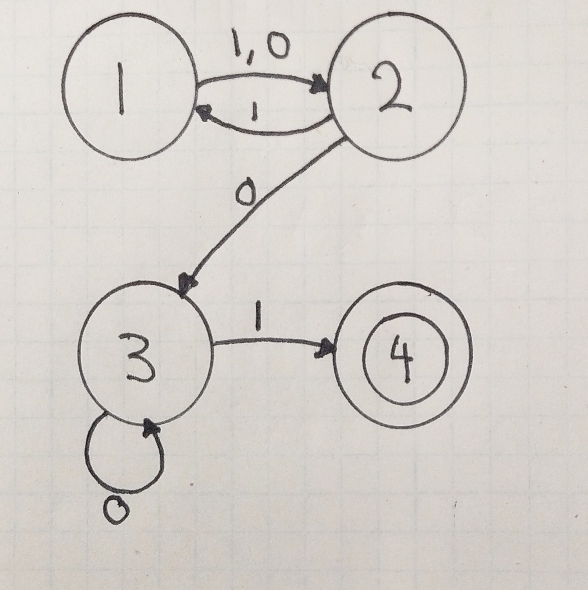

# Pumping Lemma

## Table of Contents

- [Pumping Lemma](#pumping-lemma)
  - [Table of Contents](#table-of-contents)
  - [Definition:](#definition)
  - ["In English Please" -Every Villain to Their Tech Guy](#%22in-english-please%22--every-villain-to-their-tech-guy)
  - [Example](#example)
  - [Writing a Proof Formally:](#writing-a-proof-formally)

## Definition:

I got this definition from this [video](https://www.youtube.com/watch?v=dikEDuepOtI).

If $A$ is a regular language, then $A$ has a "pumping length" $P$ such that any string $S$ where $|S|\geq P$ may be divided into 3 parts $S=x\ y\ z$ such that the following conditions must be true:

1. $x\ y^i\ z \in A$ for every $i\geq 0$
2. $|y| > 0$
3. $|xy| \leq P$

This is a very mathy definition and if you know me, I hate mathy definitions of things when it's not needed. So, let's demystify it.

## "In English Please" -Every Villain to Their Tech Guy

In plain English, this says "If a language $(A)$ is regular, then there's a threshold or a point $(P)$ such that all of the language's strings that are longer than that point can be split up into three parts that we'll call $x, y, \text{ and } z$."

Then we have 3 rules that ALL must be true of our three new segments:

1. If we have a string that's $x\ y\ z$ that's recognized by our language, then $x\ y\ y\ z$ is in our language too. In fact, we can have as many $y$s as we damn well please and the string will still be recognized by our language. Thus, $x$ is the segment before the repeat, $y$ is a part that can be repeated any number of times, and $z$ is the part after the repeat.
2. There has to be a $y$ segment. We can't split $10$ into $"1",\ "",\ "0"$
3. The $x$ and $y$ components must be at most as long as $P$. We have to leave room for $z$. This will make more sense in a minute.

Now that we have this translated into regular-people words, let's do an example.

## Example

So let's say we have a Deterministic Finite Automata like this one:

Side note: I forgot to draw an arrow pointing from state 4 to state 2 for cases 1 and 0 but I don't feel like fixing it right now so just imagine it.

This can represent a language recognizes any string that has at least 3 characters and ends with "01". So here are a few examples of strings that is does and does not like:

| Yes Please | No Thank You |
| :--------- | :----------- |
| 101        | 111          |
| 001        | 011          |
| 1001       | 0111         |
| 0001       | 1111         |
| 10001      | 10101        |
| 00001      | 1            |

Now let's start applying the pumping lemma. The pumping lemma allows us to say that a language is NOT regular but we can't use it to prove that it is. That would be the converse error. So the best we can do is say that we can't disprove it with the pumping lemma.

Let's call our language $Y$ (short for yeet because I have trash brain). If $Y$ is regular, then there must be a point $P$ where all the strings in it can be chopped up into 3 parts: $x,\ y,\ \text{and}\ z$ where $x$ is the part before the repeat, $y$ is the repeat, and $z$ is the stuff after.

We can start with finding $P$. Let's look at our best case scenario for shortest passing string. We know it can't be $1$ or $0$ because those will just leave us at state 2. We also know that it can't be $11$, $10$, $01$, or $00$ because those will leave us at states 1, 3, 1, and 3 respectively. So now we know that the ONLY way we can make it to the state 4 is if the string is at least 3. Now that we know that, we can start expanding our strings to see what else will make it through and we'll notice that once we get to state 3, we no longer give a shit how many $0$s we have as long as we end it with a 1. That means that after a string in $Y$ gets to be at least 3 long (which coincidentally is all of them), we know that our pumping length $P=3$.

Now we can figure out how to break up the strings into their $x,\ y,\ \text{and}\ z$ components. This one is easy since we've already established that any number of 0s and a 1 at the end work. So we can say that $x$ is the string up until we get to state 3, $y$ is a set of 1 or more 0s, and $z$ is the stuff at the end. So let's see if we can disprove any of our 3 conditions.

1. $x\ y^i\ z \in A$ for every $i\geq 0$

   Uh oh. This is false because $x\ y^0\ z \notin A$ because we need we can't get away with just $01$. I must admit that I tried to make this language regular when I drew the DFA so I wasn't expecting to disprove it on the first condition. Let's carry on though.

2. $|y| > 0$

   This IS true because if the string is accepted by $Y$, then we will have made it through state 3 because we can't skip i. This means that $y$ has at least 1 character

3. $|xy| \leq P$

   This is also true because $P$ is 3 and $|xy|$ is 2.

This explanation didn't quite go as planned but that's okay. Now we know that since condition 1 is false, our language $Yeet$ is NOT regular.

## Writing a Proof Formally:

Here are the steps from the video above:

- Assume $Y$ is regular
- It has to have a pumping length $P$. If not, **it's irregular**.
- Make sure all strings can be pumped (are longer than p). If not, **it's irregular**.
- Find a string $S$ that's longer than $P$ and is in $Y$
- Chop it into $x,\ y,\ \text{and}\ z$
- Look at all the ways we can chop up x into $x,\ y,\ \text{and}\ z$
- Show that at least one of the conditions is false
- Uh oh, that means that $Y$ is irregular which contradicts or original assumption that it was .
- Therefore it's irregular.
